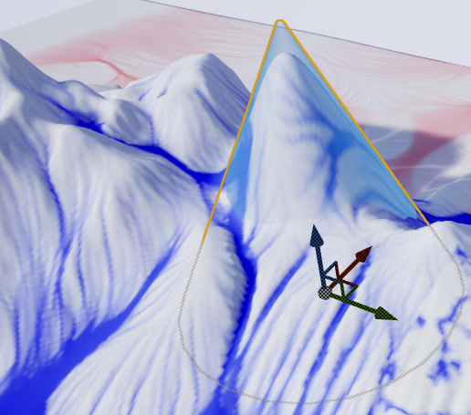
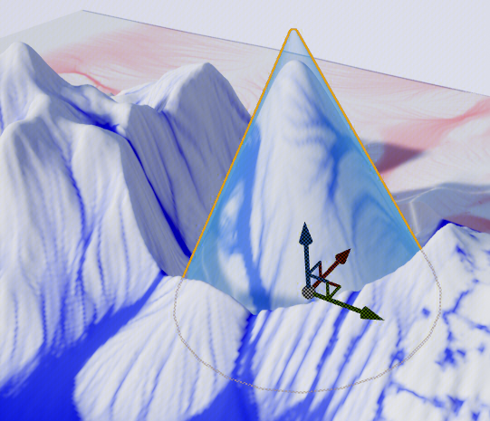
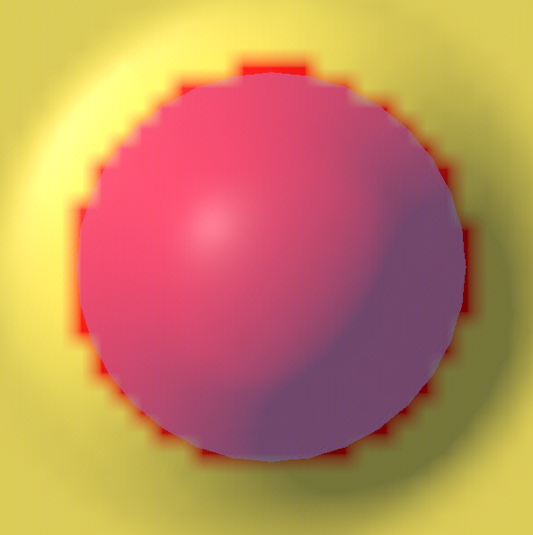
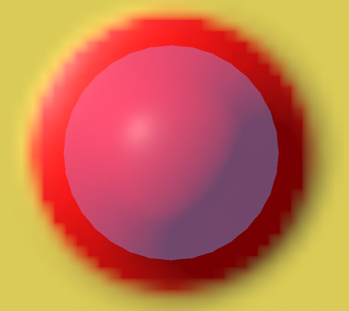
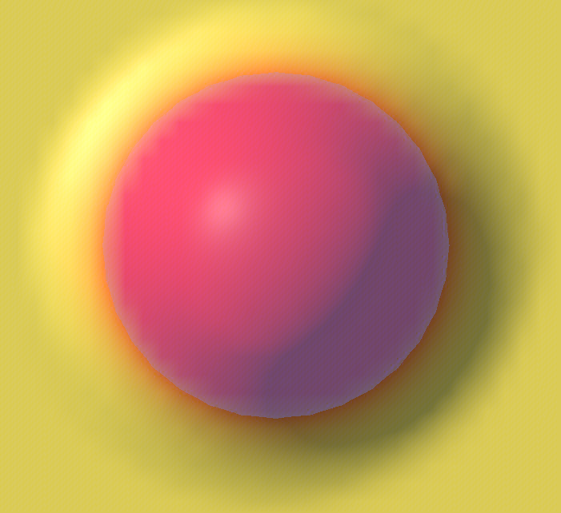

# 模型投影 Mesh Projection

machzhang(张诚)

创建，

fredqin(秦江)

修改于2022-06-29

> 由指定 Actor 的高度影响地形高度，或输出高度，所占范围等信息到 Mask 上

*   [Quick Start](#Quick-Start "Quick Start")
*   [参数说明](#%E5%8F%82%E6%95%B0%E8%AF%B4%E6%98%8E "参数说明")
*   [Targets / 目标配置](#Targets-/-%E7%9B%AE%E6%A0%87%E9%85%8D%E7%BD%AE "Targets / 目标配置")
*   [Configs / 通用配置](#Configs-/-%E9%80%9A%E7%94%A8%E9%85%8D%E7%BD%AE "Configs / 通用配置")
*   [Outputs / 输出配置](#Outputs-/-%E8%BE%93%E5%87%BA%E9%85%8D%E7%BD%AE "Outputs / 输出配置")
*   [Vertex Color / 顶点色投影相关配置](#Vertex-Color-/-%E9%A1%B6%E7%82%B9%E8%89%B2%E6%8A%95%E5%BD%B1%E7%9B%B8%E5%85%B3%E9%85%8D%E7%BD%AE "Vertex Color / 顶点色投影相关配置")
*   [FAQ](#FAQ "FAQ")
*   [如何批量添加目标](#%E5%A6%82%E4%BD%95%E6%89%B9%E9%87%8F%E6%B7%BB%E5%8A%A0%E7%9B%AE%E6%A0%87 "如何批量添加目标")
*   [怎么知道某一 Actor 到底被加进了哪个 MeshProjection 组件](#%E6%80%8E%E4%B9%88%E7%9F%A5%E9%81%93%E6%9F%90%E4%B8%80-Actor-%E5%88%B0%E5%BA%95%E8%A2%AB%E5%8A%A0%E8%BF%9B%E4%BA%86%E5%93%AA%E4%B8%AA-MeshProjection-%E7%BB%84%E4%BB%B6 "怎么知道某一 Actor 到底被加进了哪个 MeshProjection 组件")
*   [投影不起效果](#%E6%8A%95%E5%BD%B1%E4%B8%8D%E8%B5%B7%E6%95%88%E6%9E%9C "投影不起效果")

# Quick Start

1.  默认选项下，组件只会影响地形高度。如果有其他需要,可以修改启用下面的参数：
    
    1.  
        
          
        将投影范围输出到 Mask  
         
    2.  
        
          
        将投影高度输出到 Mask
2.  选中想要投影的 Actor，从世界大纲拖动到 Addictive Actors 或 Subtractive Actors 上
    

# 参数说明

### Targets / 目标配置

*   **Addictive Actors**：投影的 Actor 目标列表，默认配置下只会使地形隆起
    
    *   可以直接从世界大纲多选 Actor 和目录拖动到这里添加
        
    *   注意：添加任一 Brush （笔刷）Actor 后，实际投影目标是和组件位于同一关卡的所有 Brush 的布尔运算结果
        
*   **Subtractive Actors**： 同 Addictive Actors，不过只会降低地形
    
*   **Addictive Actor Tags，Subtractive Actor** ：类似前两个参数，不过按 Actor Tag 来指定
    
*   **Use Asset Falcon Tags, Use Field Mapping Tags：**除 Actor Tag 外，是否还考虑网格资产上的 Asset Falcon Tags Data 或 Actor Field Mapping 的 Tag 数据
    

**Project Mesh：**重新计算投影结果

**Select All：**选择所有投影目标

**Toggle Visibility：**隐藏或显示所有投影目标

### Configs / 通用配置

*   **External Mode**：启用后不把目标 Actor 纳入组件管理下。具体来说，勾选后组件会禁用掉下面的这几个默认行为：
    
    *   拖入目标后将目标移到组件当前层所在的关卡中，从而当移动、显示隐藏当前层时目标 Actor 会随之联动
        
    *   会确保将一个 Actor 加入一个投影组件后就不能加到另一个投影组件里
        
    *   将目标材质设为蓝色或红色的指示材质
        
    *   投影时暂时显示被隐藏的目标
        
    *   投影时暂时调整透明材质，碰撞设置等可能会导致投影失败的设置
        
*   **Show Our Actors Only**：激活状态下，世界大纲中只是否显示投影目标
    
*   **Bake On Target List Change**：添加删除目标后是否自动重新投影
    
*   **Bake On Target Actors Move**：激活状态下，移动旋转目标 Actor 后是否自动重新投影
    
*   **Blur Method**：高度模糊方法，使用模糊平滑过渡投影高度和原来的高度
    
    *   **Gaussian**：高斯模糊 效果较好
        
        *   **Gaussian Radius**：高斯模糊半径
            
    *   **Spiral**：使用 [SpiralBlur](https://nerivec.github.io/old-ue4-wiki/pages/how-to-use-the-spiral-blur-material-node.html "https://nerivec.github.io/old-ue4-wiki/pages/how-to-use-the-spiral-blur-material-node.html") 方法 一般较快
        
        *   **Blur Radius**：径向采样数
            
        *   **Blur Distance**：径向采样半径
            
            *   对于大地图，可适当提高 Blur Distance 以得到更明显的模糊效果
                
        *   **Blur Quality**：极角采样数
            
*   **Offset**：投影结果在水平方向以及高度上的偏移
    

**Replace Mode**：Addictive Actors 中低于输入高度的部分是否也会生效，如图：

<table data-number-column="false" data-self-adaption="false" data-auto-scale="true" class="render-table"><colgroup><col style="width: 40px;"><col style="width: 40px;"></colgroup><tbody><tr><th rowspan="1" colspan="1" colorname="" data-colwidth="10">
<strong data-renderer-mark="true">Off</strong>
</th><th rowspan="1" colspan="1" colorname="" data-colwidth="10">
<strong data-renderer-mark="true">On</strong>
</th></tr><tr><td rowspan="1" colspan="1" colorname="" data-colwidth="10">

</td><td rowspan="1" colspan="1" colorname="" data-colwidth="10">

</td></tr></tbody></table>

*   **Holder Preset**：一些为了特定目的预先配置好的参数设置。具体参考其他组件的文档，如 Power Foliage。  
      
      
    

### Outputs / 输出配置

*   **Affects Height**：是否输出地形高度
    
*   **Projection Mask Name**：是否将投影区域输出为 Mask，以及输出 Mask 的名字
    
*   **Mask Threshold**: 直到变化多大，才能使输出 Mask 为 1 的地形高度值  
      
    
    *   特殊地，设为 0 时不论实际变化，只要当前位置存在投影目标， Mask 就会输出 1
        

<table data-number-column="false" data-self-adaption="false" data-auto-scale="true" class="render-table"><colgroup><col style="width: 40px;"><col style="width: 40px;"><col style="width: 40px;"></colgroup><tbody><tr><th rowspan="1" colspan="1" colorname="" data-colwidth="10">
<strong data-renderer-mark="true">Thresold=0</strong>
</th><th rowspan="1" colspan="1" colorname="" data-colwidth="10">
<strong data-renderer-mark="true">Thresold=100</strong>
</th><th rowspan="1" colspan="1" colorname="" data-colwidth="10">
<strong data-renderer-mark="true">Thresold=500</strong>
</th></tr><tr><td rowspan="1" colspan="1" colorname="" data-colwidth="10">

</td><td rowspan="1" colspan="1" colorname="" data-colwidth="10">

</td><td rowspan="1" colspan="1" colorname="" data-colwidth="10">

</td></tr></tbody></table>

*   **Output Height Mask**：是否将投影的16位地形高度按 RG8 格式分输出到两张 Mask 上，供后续组件使用
    
    *   **Upper Mask Name，Lower Mask Name**：这两张 Mask 的名字
        

### Vertex Color / 顶点色投影相关配置

组件支持顶点色强度影响投影结果，这些配置主要用在道路影响地形上

*   **Toggle Vertex Color**：显示投影目标的顶点色
    
*   **Use Vertex Color**：启用顶点色投影
    
*   **Curve**：顶点色强度的一维函数变换
    

# FAQ

### 如何批量添加目标

可以从世界大纲中多选 Actor 或者目录，然后拖动到 Addictive Actor 或 Subtractive Actor 参数的右边

### 怎么知道某一 Actor 到底被加进了哪个 MeshProjection 组件

在 Stack 标签页启用的情况下，右键 Actor，在菜单中单击 Jump to Falcon Stack

### **投影不起效果**

可以检查下下面几项

*   是否关闭了 Stack 更新，比如这个按钮
    
    
    
    ，以及 Settings 选项卡的下面选项
    *   Disable Stack Mixing
        
    *   Disable Landscape Update
        
*   是否关闭了 **Affects Height** 选项
    
*   **External Mode** 选项开启下 Actor 的这些属性会导致投射
    
    *   材质设为了透明
        
    *   材质中是否修改了 Pixel Depth Offset
        
    *   没有 Collision
        
    *   Visible、Actor Hidden in Game 属性以及世界大纲上的眼睛导致 Actor 被隐藏
        

优而赞之，手有余香

成为第一个点赞的人

*   本文引用
*   本文被引用

场景信息识别常见操作

功能盘点

*   463
    
*   70
    
*   0
    

添加标签

发表评论，抢沙发...

