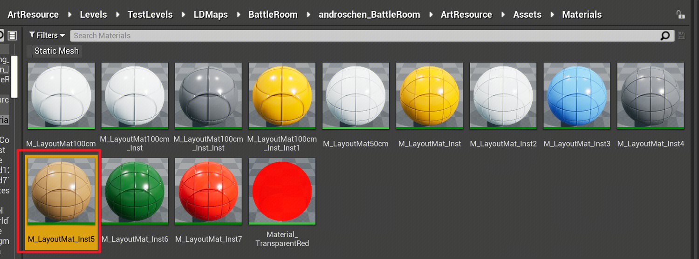
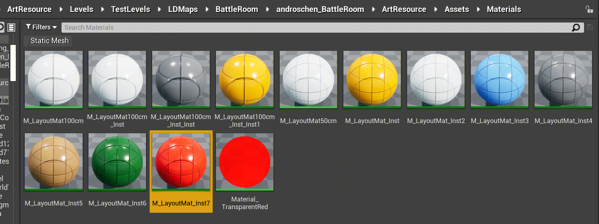
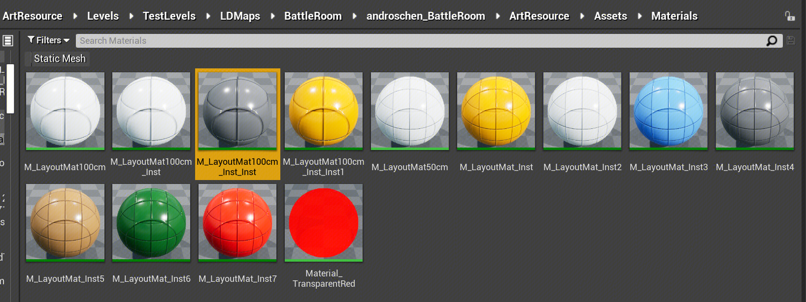
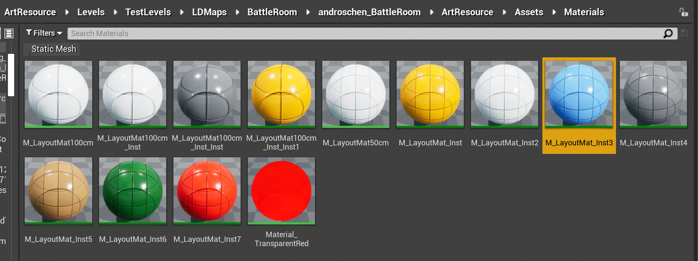
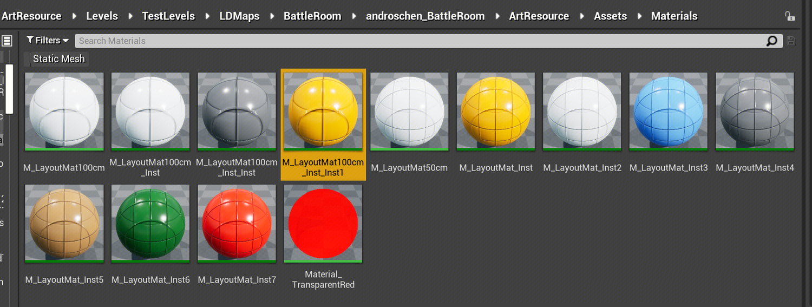
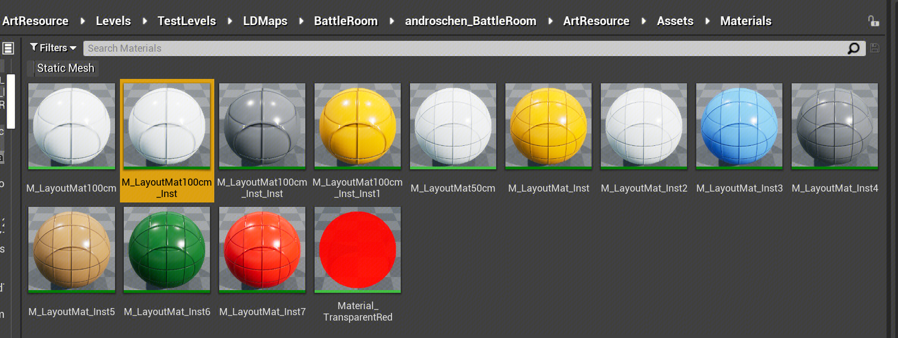

# Breakout 荒野地区地形地貌程序化生成

coenjin(金沛沛)

创建，最后修改于2023-09-27

包含 **南部地区** 和 **核心区域** 的地形地貌程序化生成

荒野地区地形地貌，根据 LD 摆放的不同类型白盒作为引导进行生成（白盒输入规范参考下文）。

# 组件逻辑

与荒野区域地形地貌相关的有两个层，分别是 Land\_Plan 和 Land\_South/Land\_Core；

## Land\_Plan

用来确定荒野区域的合成范围，给到 Land\_South/Land\_Core 层作为 region mask

这个区域目前是通过手绘的方式来确定，进入 variant mask 的 Component mask 中即可看到对应的手绘mask

## Land\_South/Land\_Core

Land\_South/Land\_Core层基于白盒程序化生成南部区域的地形；

### 生成逻辑

1.  投射地形最低高度（基于**Lowest Height**地形白盒）
    
2.  分别投射 **Unlimited Height** 和 **Limited Height** 两种白盒高度，得到两种白盒的Mask（其中 Unlimited Height 白盒只有在比 Limited Height 白盒高时才会计算投射mask）
    
3.  添加 noise 地形起伏
    
4.  添加随机平台，丰富地形结构
    
5.  Realtime Erosion，添加基础地形侵蚀效果（沉积效果）
    
6.  Gaea Stack 添加更加真实的地形侵蚀沉积效果（较强的侵蚀）
    
7.  由于大侵蚀会破坏 **Limited Height** 的白盒对应的地形高度，因此对 **Limited Height** 白盒再投射一次地形高度
    
8.  添加一些 Distort、Ridge、Rocky 的地形细节，准备整体的小侵蚀；
    
9.  Gaea Stack 添加最后的地形侵蚀效果（小侵蚀，主要用于丰富细节，输出Mask用于给到地形权重）
    
10.  基于侵蚀结果，添加地形权重
    

### 更新与适配

如果在场景中，修改了白盒（增加白盒物体，或者修改白盒的Transform），可以执行以下操作来重新计算**投射**和**侵蚀**组件（这两类组件需要手动重新计算，因为如果自动运算，会导致场景编辑非常卡）

1、首先对一开始的几个 MeshProjection 组件进行重新投射

2、对大侵蚀组件进行重新cook

3、对 Limited Height 白盒进行重新投射

4、对小侵蚀进行重新 cook

# 白盒输入规范

在程序化组件上，会自动拾取当前场景 **指定关卡** 内 **对应材质实例** 的**所有白盒**进行计算，**在对应的地形区域生成特定地形地貌**，为了防止在计算时出现冲突，需要LD在搭建白盒时，在白盒关卡内根据特定规范用不同的材质实例来表示白盒的具体的含义，这样可以方便后续程序化地生成和调整。

其中**地形（Unlimited Height）**、**地形（Limited Height）**、**地形（Lowest Height）**三种白盒会被程序化层所拾取并进行计算，因此需要**这三种白盒使用特定的材质实例**，其他白盒使用的材质实例与这三种白盒保持不同。

<table data-number-column="false" data-self-adaption="false" data-auto-scale="false" class="render-table"><colgroup><col style="width: 195px;"><col style="width: 268px;"></colgroup><tbody><tr><th rowspan="1" colspan="1" colorname="" data-colwidth="196">
<strong data-renderer-mark="true">示意对象</strong>
</th><th rowspan="1" colspan="1" colorname="" data-colwidth="269">
<strong data-renderer-mark="true">材质实例路径</strong>
</th></tr><tr><td rowspan="1" colspan="1" colorname="" data-colwidth="196">
<strong data-renderer-mark="true">地形（Unlimited Height，表示大概的地形高度，程序化生成的结果只会大致吻合白盒表示）</strong>
</td><td rowspan="1" colspan="1" colorname="" data-colwidth="269">

</td></tr><tr><td rowspan="1" colspan="1" colorname="" data-colwidth="196">
<strong data-renderer-mark="true">地形（Limited Height，表示准确的地形高度，程序化生成结果会尽可能贴近白盒表示）</strong>
</td><td rowspan="1" colspan="1" colorname="" data-colwidth="269">

</td></tr><tr><td rowspan="1" colspan="1" colorname="" data-colwidth="196">
<strong data-renderer-mark="true">地形（Lowest Height，表示当前区域最低高度；摆放高度不得高于上面两种地形白盒，用于填充无用区域）</strong>
</td><td rowspan="1" colspan="1" colorname="" data-colwidth="269">

</td></tr><tr><td rowspan="1" colspan="1" colorname="" data-colwidth="196">
河流（程序化层不拾取，纯示意）
</td><td rowspan="1" colspan="1" colorname="" data-colwidth="269">

</td></tr><tr><td rowspan="1" colspan="1" colorname="" data-colwidth="196">
道路（程序化层不拾取，纯示意）
</td><td rowspan="1" colspan="1" colorname="" data-colwidth="269">

</td></tr><tr><td rowspan="1" colspan="1" colorname="" data-colwidth="196">
POI（程序化层不拾取，纯示意）
</td><td rowspan="1" colspan="1" colorname="" data-colwidth="269">

</td></tr><tr><td rowspan="1" colspan="1" colorname="" data-colwidth="196">
围墙（程序化层不拾取，纯示意）
</td><td rowspan="1" colspan="1" colorname="" data-colwidth="269">
&nbsp;
</td></tr></tbody></table>

优而赞之，手有余香

成为第一个点赞的人

*   本文引用
*   本文被引用

2023-08-14 coenjin

*   108
    
*   14
    
*   0
    

添加标签

发表评论，抢沙发...

